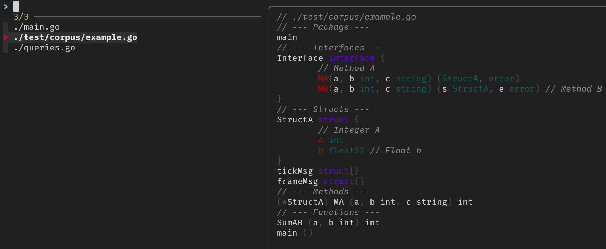

# go-api

Summary of `go` API in one `.go` file using tree-sitter.

```go
❯ go-api --path ./main.go --format /picvnsmf

// ./main.go
// --- Package ---
main
// --- Imports ---
"context"
"flag"
"fmt"
"log"
"os"
"os/exec"
"path/filepath"
"strings"
sitter "github.com/smacker/go-tree-sitter"
"github.com/smacker/go-tree-sitter/golang"
// --- Structs ---
FileStructure 
// --- Methods ---
(f FileStructure) String () string 
(f FileStructure) PrintPackage (data []byte) string 
(f FileStructure) PrintNodes (title string, nodes []*sitter.Node, select_fn func(*sitter.Node) *sitter.Node, data []byte) string 
(f FileStructure) PrintNestedNodes (title string, nodes []*sitter.Node, print_block bool, select_fn func(*sitter.Node) *sitter.Node, data []byte) string 
(f FileStructure) Print (format string, n *sitter.Node, lang *sitter.Language, data []byte) string 
// --- Functions ---
getNode (n *sitter.Node) *sitter.Node 
getFirstChild (n *sitter.Node) *sitter.Node 
getFirstNamedChild (n *sitter.Node) *sitter.Node 
GoFiles (path string) ([]string, error) 
NodesFromQuery (query []byte, root *sitter.Node, lang *sitter.Language, data []byte) []*sitter.Node 
HighlightOutput (text string) (string, error) 
main () 
```

Usable with [`fzf`](https://github.com/junegunn/fzf):

```bash
go-api-fzf DIRECTORY [FORMAT=/pNSmf]
```



Options:

- `--path` : path to `.go` file
- `--format` (default=`/picvnsmf`) : components to print
- `--nohighlight` (default=`false`) : do not highlight


## Format

Printed in order of letters in string provided to `--format`.

    Uppercase -> Print full content
    (x) -> Full content not yet implemented

- `/`: path
- `p`, `P`: Package (x)
- `i`, `I`: Imports (x)
- `c`, `C`: Constants (x)
- `v`, `V`: Variables (x)
- `n`, `N`: Interfaces
- `s`, `S`: Structs
- `m`, `M`: Methods
- `f`, `F`: Functions

**Prerequisites:**

- `tree-sitter` for highlight, if not present fails with printed warning

## Installation

**Building:**

Git clone and buid

```bash
git clone https://github.com/manyids2/go-api
cd go-api
go build .
```

**Options to use the binary:**

1. Add to `PATH` in shell rc file

   - bash : `echo "export PATH $PATH:$(pwd)" >> ~/.bashrc` (then modify `~/.bashrc`)
   - fish : `echo "set -gx PATH $PATH (pwd)" >> ~/.config/fish/config.fish` (then modify `~/.config/fish/config.fish`)

2. Move to `~/.local/bin`

```bash
mv go-api ~/.local/bin/go-api
mv go-api-fzf ~/.local/bin/go-api-fzf
```

3. `sudo` move to `/usr/bin`

```bash
sudo mv go-api /usr/bin/go-api
sudo mv go-api-fzf /usr/bin/go-api-fzf
```

**Clean up:**

Delete git repo:

```bash
# cd ..
# rm -rf go-api/ # WARNING: Use with caution, uncomment yourself if sure
```

**Uninstall:**

Remove binaries from where it is installed, if need be with sudo.

Bash:

```bash
rm $(which go-api)
rm $(which go-api-fzf)
```

Fish:

```bash
rm (which go-api)
rm (which go-api-fzf)
```
